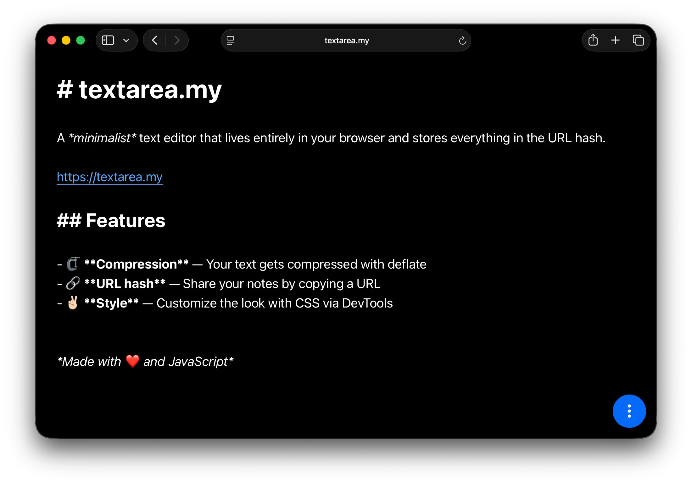

# [textarea.my](https://textarea.my)

A _minimalist_ text editor that lives entirely in your browser and stores everything in the URL hash.

  

## Features

- 🗜️ **Compression** – Your text gets compressed with deflate
- 🔗 **URL hash** – Share your notes by copying a URL
- 💕 **Style** – Customize the look with CSS via DevTools

## Pro tips

- Start your document with `# Title` to set a custom page title
- Your data lives in localStorage AND the URL. Double the fun!
- Add a `style` attribute to the `<article>` tag via DevTools. It'll be saved in the URL too!
- Add [`/qr`](https://textarea.my/qr#c0_NSy1KLElVSFQIDFJIzk9JVUjLL1KozC8tUsjLL0ktVgQA) to get a QR code for the current page

## Examples

<!-- - [Crime and Punishment (by Fyodor Dostoevsky)](https://medv.io/goto/crime-and-punishment-by-fyodor-dostoevsky.html) -->
- [A Markdown Example](https://textarea.my/#Xc9NT8JAEAbg-_6KV7hAQyB86AFCjDdMiAej9y7dobuy7NTdqWKM_e2mhVOP88z3EDvSxoUSe_oij7lSw2HPFq31cdlhX1dX7fP9jfv-oNQLx7P2qHTUZdSVhdBFcKAjR4IL3gXCsa0RcaGcKvVmXULHBQfRLiRk2YG96TqzbILMifauuMYT6GDQNEmiO5HYyHV5XdI00N5DuCSxFKdKPYfbXEOgiz5XntbICw5JcMEWq8UmV-oJ7697JMu1NzgQDAkVQqZbJHUMZOCCMHR75mkNK1Kl9Wx2Gzkt-DyrtNjHz5riz3a-WA6tTlapPM8_kjrWoRDHAZa859EYvwrtr4k9TT2Xo8GuTUzwzdGbu8F4o_7a1n8=)
- [An Ode to Comic Sans](https://textarea.my/#TVM9j9w2EE3NX_FwaRJAtwe4SHGu7g5I4MII4HNgpByRI4lZiqPMjFbeVPsj0hiI_9z-koCyDV9FznA-33v8EQ8VvyeGC55kzhHPVC2E73eQaj6xYcs-yeogO-Y6duEBo-aKXOHnRUalZcoRg-jchedJuFBkw1o9c-pghblVUSmFE9alC09KNuU6widGT_XvlR0ywFjzAKoJVXQ-hPAoWlFlf5xJ-8KYqBSDKApt6DXzYF14XB1JJBW2DrYwxwn92ve7TZioptuktFUshakLb7xF0dH2JSbGSXLk1qUZsZCZisxYxJz1Plwv_z0yjrmm7nr5jGbSkWFU-JvjVQMAgzIfrpfPIbyf-Ds8rAaLMgwdKP21mrc-WXFkrTukT2X1OOE3UpqlJpR8ZCxMWgzkSLTVQ_iT_QVV2OjU1lsr9WQTpy48Tcw6rKWcsanUsYP52veitZwh9RDa4ptmZ0Of1adEZ0TSZDvoRcxvk4wYypnVWr1V44TKmxV2bz5YHqvBaeGEqCJHTk1CSUTt0OonYds526ZsCysWZfM8ciNtkY31evl3Z6CJyroG3jsu9PGAD3y9fDoxjLliE7WvWL6VeGxSmnluBztrpbZlX2jmFH4VRdQ8syE7Kp9YQUUqI8o8Z_cGzhtHz6S2U7xxHqddVtM6U4WTOYcP2ScQbM6F4RM5ItXr5VPLBKfsnA4hPNQE81xKa7awWjb_KrNlOYNizImrd-GPGkVKY6gXn1jb7GtVHnJtA73jOdf07RtsoiV1TY8qa03ceqgc2brwvk3SEKVSWlwyVP4C-8akIHjmww8BAHqKx3GvcI9Vy093dzOn0yHLHZmx2505qR3GPPz8ek8YpPrtQHMu53vcvJDX2-eb7qXjpkNc1fKJXyRa_ofv8eqX5eMXZ5Qiet-od34d_gc=)

## Related

- [wiki](https://github.com/antonmedv/wiki) – a single file Wiki engine based on textarea.my

---

*Made with ❤️ and JavaScript*
